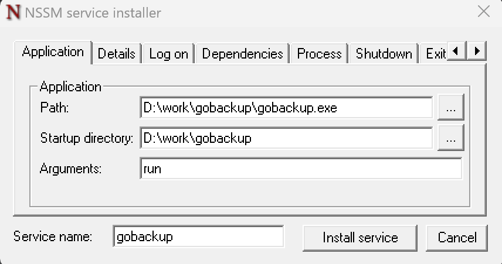
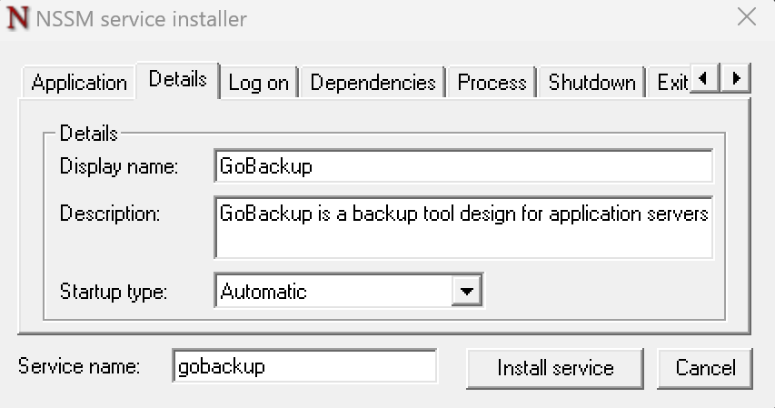
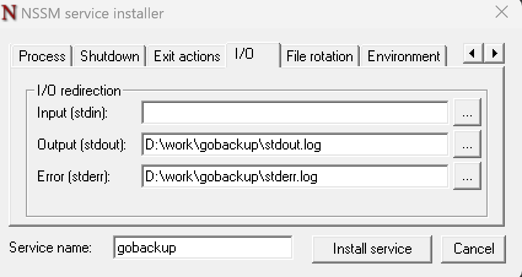

# Guide for running as a Windows service

You can run the server as a Windows service using the `nssm` utility.

## Using nssm

### Params
Please update the next params with your values:
- Application Path - path to the `gobackup.exe` with the file itself
- Application Startup directory - path to the `gobackup.exe` without the file itself
- Application Arguments - `run` command. You can add any other CLI arguments here.
- Details Display Name - the name of the service
- Details Description - the description of the service
- Details Startup type - the startup type of the service
- I/O Output - path to the file to write the stdout of the service
- I/O Error - path to the file to write the stderr of the service

### Install service
```powershell
nssm.exe install gobackup
```
  
  


### Remove service
```powershell
nssm remove gobackup
```